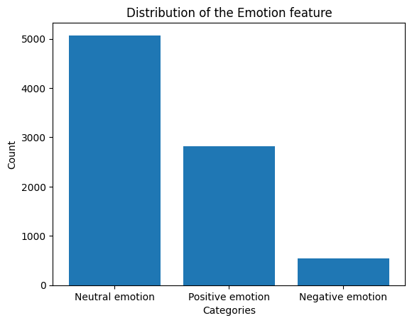

## 1. **Business Understanding**

### Overview

SentimentFlow aims to address a real-world problem related to understanding public sentiment towards Apple and Google products on Twitter. The stakeholders include companies, marketing teams, and decision-makers who want to gauge public opinion and make informed strategic decisions based on social media sentiment.

### Problem Statement

The problem is to accurately classify the sentiment of tweets related to Apple and Google products. We want to determine whether a tweet expresses a positive, negative, or neutral sentiment. This classification can help companies understand customer satisfaction, identify potential issues, and tailor their responses accordingly.

### Stakeholders

1. **Companies (Apple and Google):** These organizations are directly impacted by public sentiment. They want to monitor how their products are perceived and identify areas for improvement.

2. **Marketing Teams:** Marketing teams can use sentiment analysis to adjust their campaigns, respond to negative feedback, and highlight positive aspects of their products.

3. **Decision-Makers:** Executives and managers need insights into public sentiment to make informed decisions about product development, customer support, and brand reputation.

### Value Proposition

By accurately classifying tweets, our NLP model can provide actionable insights to stakeholders. For example:
- Identifying negative sentiment can help companies address issues promptly.
- Recognizing positive sentiment can guide marketing efforts and reinforce successful strategies.
- Understanding neutral sentiment can provide context and balance.

### Objectives

Main Objective

> To develop a NLP (Natural Language Processing) multiclass classification model for sentiment analysis, aim to achieve a recall score of 85% and an accuracy of 90%. The model should categorize sentiments into three classes: Positive, Negative, and Neutral.

Specific Objectives

* To idenitfy the most common words used in the dataset using Word cloud.

* To confirm the most common words that are positively and negatively tagged.

* To recognize the products that have been opined by the users.

* To spot the distribution of the sentiments.

### Conclusion

Our NLP model will contribute valuable insights to the real-world problem of understanding Twitter sentiment about Apple and Google products. Stakeholders can leverage this information to enhance their decision-making processes and improve overall customer satisfaction.

## 2. **Data Understanding**

### Data Sources
The dataset originates from CrowdFlower via data.world. Contributors evaluated tweets related to various brands and products. Specifically:
- Each tweet was labeled as expressing positive, negative, or no emotion toward a brand or product.
- If emotion was expressed, contributors specified which brand or product was the target.

### Suitability of Data
Here's why this dataset is suitable for our project:
1. **Relevance:** The data directly aligns with our business problem of understanding Twitter sentiment for Apple and Google products.
2. **Real-World Context:** The tweets represent actual user opinions, making the problem relevant in practice.
3. **Multiclass Labels:** We can build both binary (positive/negative) and multiclass (positive/negative/neutral) classifiers using this data.

### Dataset Size
The dataset contains over 9,000 labeled tweets. We'll explore its features to gain insights.

### Descriptive Statistics
- **tweet_text:** The content of each tweet.
- **is_there_an_emotion_directed_at_a_brand_or_product:** No emotion toward brand or product, Positive emotion, Negative emotion, I can't tell
- **emotion_in_tweet_is_directed_at:** The brand or product mentioned in the tweet.

### Feature Inclusion
Tweet text is the primary feature. The emotion label and target brand/product are essential for classification.

### Limitations
- **Label Noise:** Human raters' subjectivity may introduce noise.
- **Imbalanced Classes:** We'll address class imbalance during modeling.
- **Contextual Challenges:** Tweets are often short and context-dependent.
- **Incomplete & Missing Data:** Could affect the overall performance of the models.

## 3. **Data Loading**


```python
# Import necessary libraries and modules
import pandas as pd
import numpy as np

# plotting
import seaborn as sns
from wordcloud import WordCloud
import matplotlib.pyplot as plt

# nltk
import re
import string
import nltk
from nltk.corpus import stopwords
from nltk.probability import FreqDist
from nltk.stem import WordNetLemmatizer


# Download required NLTK data
nltk.download('stopwords')
nltk.download('wordnet')
nltk.download('averaged_perceptron_tagger')

# sklearn
from sklearn.svm import SVC
from sklearn.svm import LinearSVC
from imblearn.over_sampling import SMOTE
from sklearn.naive_bayes import BernoulliNB
from sklearn.preprocessing import LabelEncoder

from sklearn.linear_model import LogisticRegression
from sklearn.ensemble import RandomForestClassifier
from sklearn.model_selection import train_test_split,cross_val_score

from sklearn.naive_bayes import MultinomialNB

from sklearn.model_selection import GridSearchCV
from sklearn.metrics import confusion_matrix, classification_report, accuracy_score, recall_score

from sklearn.feature_extraction.text import TfidfVectorizer, CountVectorizer
from sklearn.model_selection import GridSearchCV
from sklearn.tree import DecisionTreeClassifier

# wordCloud
from wordcloud import WordCloud
```

    [nltk_data] Downloading package stopwords to C:\Users\PROBOOK
    [nltk_data]     6460\AppData\Roaming\nltk_data...
    [nltk_data]   Package stopwords is already up-to-date!
    [nltk_data] Downloading package wordnet to C:\Users\PROBOOK
    [nltk_data]     6460\AppData\Roaming\nltk_data...
    [nltk_data]   Package wordnet is already up-to-date!
    [nltk_data] Downloading package averaged_perceptron_tagger to
    [nltk_data]     C:\Users\PROBOOK 6460\AppData\Roaming\nltk_data...
    [nltk_data]   Package averaged_perceptron_tagger is already up-to-
    [nltk_data]       date!
    

### ***Class Creation***


```python
class DataUnderstanding():
    """Class that gives the data understanding of a dataset"""
    def __init__(self, data='None'):
        """Initialisation"""
        self.df = data

    def load_data(self, path):
        """Loading the data"""
        if self.df == 'None':
            self.df = pd.read_csv(path, encoding='latin-1')
        return self.df

    def understanding(self):
        # Info
        print("""INFO""")
        print("-"*4)
        self.df.info()

        # Shape
        print("""\n\nSHAPE""")
        print("-"*5)
        print(f"Records in dataset are {self.df.shape[0]} with {self.df.shape[1]} columns.")

        # Columns
        print("\n\nCOLUMNS")
        print("-"*6)
        print(f"Columns in the dataset are:")
        for idx in self.df.columns:
            print(f"- {idx}")

        # Unique Values
        print("\n\nUNIQUE VALUES")
        print("-"*12)
        for col in self.df.columns:
            print(f"Column *{col}* has {self.df[col].nunique()} unique values")
            if self.df[col].nunique() < 12:
                print(f"Top unique values in the *{col}* include:")
                for idx in self.df[col].value_counts().index:
                    print(f"- {idx}")
            print("")

        # Missing or Null Values
        print("""\nMISSING VALUES""")
        print("-"*15)
        for col in self.df.columns:
            print(f"Column *{col}* has {self.df[col].isnull().sum()} missing values.")

        # Duplicate Values
        print("""\n\nDUPLICATE VALUES""")
        print("-"*16)
        print(f"The dataset has {self.df.duplicated().sum()} duplicated records.")
```

### ***Load the data set***


```python
# Load the dataset
data = DataUnderstanding()
df = data.load_data(path="judge_tweet_product_company.csv")
# First five rows of dataset
df.head()
```


<div>
<style scoped>
    .dataframe tbody tr th:only-of-type {
        vertical-align: middle;
    }

    .dataframe tbody tr th {
        vertical-align: top;
    }

    .dataframe thead th {
        text-align: right;
    }
</style>
<table border="1" class="dataframe">
  <thead>
    <tr style="text-align: right;">
      <th></th>
      <th>tweet_text</th>
      <th>emotion_in_tweet_is_directed_at</th>
      <th>is_there_an_emotion_directed_at_a_brand_or_product</th>
    </tr>
  </thead>
  <tbody>
    <tr>
      <th>0</th>
      <td>.@wesley83 I have a 3G iPhone. After 3 hrs twe...</td>
      <td>iPhone</td>
      <td>Negative emotion</td>
    </tr>
    <tr>
      <th>1</th>
      <td>@jessedee Know about @fludapp ? Awesome iPad/i...</td>
      <td>iPad or iPhone App</td>
      <td>Positive emotion</td>
    </tr>
    <tr>
      <th>2</th>
      <td>@swonderlin Can not wait for #iPad 2 also. The...</td>
      <td>iPad</td>
      <td>Positive emotion</td>
    </tr>
    <tr>
      <th>3</th>
      <td>@sxsw I hope this year's festival isn't as cra...</td>
      <td>iPad or iPhone App</td>
      <td>Negative emotion</td>
    </tr>
    <tr>
      <th>4</th>
      <td>@sxtxstate great stuff on Fri #SXSW: Marissa M...</td>
      <td>Google</td>
      <td>Positive emotion</td>
    </tr>
  </tbody>
</table>
</div>


```python
data.understanding()
```

    INFO
    ----
    <class 'pandas.core.frame.DataFrame'>
    RangeIndex: 9093 entries, 0 to 9092
    Data columns (total 3 columns):
     #   Column                                              Non-Null Count  Dtype 
    ---  ------                                              --------------  ----- 
     0   tweet_text                                          9092 non-null   object
     1   emotion_in_tweet_is_directed_at                     3291 non-null   object
     2   is_there_an_emotion_directed_at_a_brand_or_product  9093 non-null   object
    dtypes: object(3)
    memory usage: 213.2+ KB
    
    
    SHAPE
    -----
    Records in dataset are 9093 with 3 columns.
    
    
    COLUMNS
    ------
    Columns in the dataset are:
    - tweet_text
    - emotion_in_tweet_is_directed_at
    - is_there_an_emotion_directed_at_a_brand_or_product
    
    
    UNIQUE VALUES
    ------------
    Column *tweet_text* has 9065 unique values
    
    Column *emotion_in_tweet_is_directed_at* has 9 unique values
    Top unique values in the *emotion_in_tweet_is_directed_at* include:
    - iPad
    - Apple
    - iPad or iPhone App
    - Google
    - iPhone
    - Other Google product or service
    - Android App
    - Android
    - Other Apple product or service
    
    Column *is_there_an_emotion_directed_at_a_brand_or_product* has 4 unique values
    Top unique values in the *is_there_an_emotion_directed_at_a_brand_or_product* include:
    - No emotion toward brand or product
    - Positive emotion
    - Negative emotion
    - I can't tell
    
    
    MISSING VALUES
    ---------------
    Column *tweet_text* has 1 missing values.
    Column *emotion_in_tweet_is_directed_at* has 5802 missing values.
    Column *is_there_an_emotion_directed_at_a_brand_or_product* has 0 missing values.
    
    
    DUPLICATE VALUES
    ----------------
    The dataset has 22 duplicated records.
    

***
Comments:
- All the columns are in the correct data types.

- The columns will need to be renamed.

- Features with missing values should be renamed from NaN.

- Duplicate records should be dropped.

- All records with the target as "I can't tell" should be dropped.

- Corrupted records should be removed.

- Rename values in the *is_there_an_emotion_directed_at_a_brand_or_product* where the value is 'No emotion toward brand or product' to 'Neutral Emotion'
***

## 4.0. Data Cleaning

### 4.1. Validity

#### 4.1.1. Corrupted Records in the *tweet_text* Column

The data seems to be corrupted in some records. To correct this issue, we create a function that can find these corrupted records, and returns their indexes. We use this index to remove the record from the working dataframe.


```python
# A function targeting corrupted records
def is_corrupted(tweet):
    """This func returns the index of any record that is corrupted"""
    corrupted_cols = []
    for key, text in enumerate(tweet):
        if any(ord(char) > 127 for char in str(text)) == True:
            corrupted_cols.append(key)
    return corrupted_cols
```


```python
# Applying the is_corrupted function to find the indexes of the corrupted records
corrupted_records_idx = is_corrupted(df['tweet_text'])
```


```python
# Test to check if the function worked as intended
df.loc[corrupted_records_idx]['tweet_text'].values[0]
```


    '@mention  - False Alarm: Google Circles Not Coming Now\x89ÛÒand Probably Not Ever? - {link} #Google #Circles #Social #SXSW'


```python
# Drop these records
df.drop(index=corrupted_records_idx, inplace=True)
```


```python
# Test to ensure there are no corrupted records left
is_corrupted(df['tweet_text'])
```


    []


#### 4.1.2. Drop Records in the *is_there_an_emotion_directed_at_a_brand_or_product* column where the value is "I can't tell"


```python
# Identification of the record
bad_reaction_idx = df[df['is_there_an_emotion_directed_at_a_brand_or_product'] == "I can't tell"].index

# Drop the columns
df.drop(index = bad_reaction_idx, inplace=True)

# Test
df[df['is_there_an_emotion_directed_at_a_brand_or_product'] == "I can't tell"]
```


<div>
<style scoped>
    .dataframe tbody tr th:only-of-type {
        vertical-align: middle;
    }

    .dataframe tbody tr th {
        vertical-align: top;
    }

    .dataframe thead th {
        text-align: right;
    }
</style>
<table border="1" class="dataframe">
  <thead>
    <tr style="text-align: right;">
      <th></th>
      <th>tweet_text</th>
      <th>emotion_in_tweet_is_directed_at</th>
      <th>is_there_an_emotion_directed_at_a_brand_or_product</th>
    </tr>
  </thead>
  <tbody>
  </tbody>
</table>
</div>


#### 4.1.3.Replace Fields in the *is_there_an_emotion_directed_at_a_brand_or_product* column where the value is "No emotion toward brand or product" to "Neutral emotion"


```python
# Identification of the record
neutral_reaction_idx = df[df['is_there_an_emotion_directed_at_a_brand_or_product'] ==\
                              "No emotion toward brand or product"].index

# Replace the values
df.loc[neutral_reaction_idx, 'is_there_an_emotion_directed_at_a_brand_or_product'] = "Neutral emotion"

# Test
df[df['is_there_an_emotion_directed_at_a_brand_or_product'] == "No emotion toward brand or product"]
```


<div>
<style scoped>
    .dataframe tbody tr th:only-of-type {
        vertical-align: middle;
    }

    .dataframe tbody tr th {
        vertical-align: top;
    }

    .dataframe thead th {
        text-align: right;
    }
</style>
<table border="1" class="dataframe">
  <thead>
    <tr style="text-align: right;">
      <th></th>
      <th>tweet_text</th>
      <th>emotion_in_tweet_is_directed_at</th>
      <th>is_there_an_emotion_directed_at_a_brand_or_product</th>
    </tr>
  </thead>
  <tbody>
  </tbody>
</table>
</div>


### 4.2. Completeness

#### 4.2.1. Drop Missing Values in the *tweet_text* column


```python
tweet_missing = df[df['tweet_text'].isnull() == True].index
df.loc[tweet_missing]
```


<div>
<style scoped>
    .dataframe tbody tr th:only-of-type {
        vertical-align: middle;
    }

    .dataframe tbody tr th {
        vertical-align: top;
    }

    .dataframe thead th {
        text-align: right;
    }
</style>
<table border="1" class="dataframe">
  <thead>
    <tr style="text-align: right;">
      <th></th>
      <th>tweet_text</th>
      <th>emotion_in_tweet_is_directed_at</th>
      <th>is_there_an_emotion_directed_at_a_brand_or_product</th>
    </tr>
  </thead>
  <tbody>
    <tr>
      <th>6</th>
      <td>NaN</td>
      <td>NaN</td>
      <td>Neutral emotion</td>
    </tr>
  </tbody>
</table>
</div>


```python
# Drop the record
df.drop(index=tweet_missing, inplace=True)
```


```python
# Check
df[df['tweet_text'].isnull() == True]
```


<div>
<style scoped>
    .dataframe tbody tr th:only-of-type {
        vertical-align: middle;
    }

    .dataframe tbody tr th {
        vertical-align: top;
    }

    .dataframe thead th {
        text-align: right;
    }
</style>
<table border="1" class="dataframe">
  <thead>
    <tr style="text-align: right;">
      <th></th>
      <th>tweet_text</th>
      <th>emotion_in_tweet_is_directed_at</th>
      <th>is_there_an_emotion_directed_at_a_brand_or_product</th>
    </tr>
  </thead>
  <tbody>
  </tbody>
</table>
</div>


#### 4.2.2. Fill Missing Values in the *emotion_in_tweet_is_directed_at* column


```python
# Find the records with missing values in the 2nd column
df[df['emotion_in_tweet_is_directed_at'].isnull() == True].shape[0]
```


    5331


```python
# List of unique products/ services
products = list(df.emotion_in_tweet_is_directed_at.unique())
products.remove(np.nan) # Removes any np.nan items

def find_product(tweet):
    """This func takes in a tweet and returns the product talked about in the
    tweet; used to fill in the emotion_in_tweet_is_directed_at column"""
    for product in products:
        if str(product) in tweet or str(product).upper() in tweet \
            or  str(product).lower() in tweet or str(product).title() in tweet:
            return product

# Applying the function to find the index of records with missing values in the 2nd column
missing_products_idx = df[df['emotion_in_tweet_is_directed_at'].isnull() == True].index
```


```python
# Replace the field where there are missing values in the emotion_in_tweet_is_directed_at column
df.loc[missing_products_idx, 'emotion_in_tweet_is_directed_at'] = df.loc[missing_products_idx, 'tweet_text']\
                                                                        .apply(lambda x: find_product(x))
```


```python
# In case any field was not captured by our function, we can change it to 'None'
none_index = df[df['emotion_in_tweet_is_directed_at'].isnull()].index
df.loc[none_index, 'emotion_in_tweet_is_directed_at'] = 'None'
# df.loc[none_index]
```


```python
# Check
df['emotion_in_tweet_is_directed_at'].value_counts()
```


    emotion_in_tweet_is_directed_at
    iPad                               2273
    Google                             1984
    Apple                              1269
    iPhone                             1093
    None                                720
    iPad or iPhone App                  448
    Android                             284
    Other Google product or service     278
    Android App                          77
    Other Apple product or service       33
    Name: count, dtype: int64


```python
# Number of values in the column are the same as the length of the data
np.sum(df['emotion_in_tweet_is_directed_at'].value_counts().values) == df.shape[0]
```


    True


##### Observation
> * Noting that the missing data consists of over 5000 rows, this represent a significant proportion of the data if we dropped this data.

> * To counter this problem, knowing that there are limited observable products in the 2nd column, we can read each tweet and, find and replace the missing value with the relevant product the tweett talks about.

> * In the end, we were able to assign all tweets to a product and only 720 were not talking about a product explicitly.

### 4.3 Consistency

#### 4.3.1. Drop the Duplicates


```python
# Dropping the duplicates
df.drop_duplicates(inplace=True)
```


```python
# Check if there is any remaining duplicate values
df.duplicated().sum()
```


    0


### 4.4. Uniformity

#### 4.4.1. Renaming the columns


```python
# Change the column names
df.rename(columns={'tweet_text': "tweet",
                  'emotion_in_tweet_is_directed_at':"product",
                  'is_there_an_emotion_directed_at_a_brand_or_product': "emotion"},
         inplace=True)
```


```python
# Check
df.columns
```


    Index(['tweet', 'product', 'emotion'], dtype='object')


#### 4.4.2. Reset the Index of the dataframe


```python
# Reset the index
df.reset_index(inplace=True)
# Drop the old index column
df.drop(labels='index', axis=1, inplace=True)
df
```


<div>
<style scoped>
    .dataframe tbody tr th:only-of-type {
        vertical-align: middle;
    }

    .dataframe tbody tr th {
        vertical-align: top;
    }

    .dataframe thead th {
        text-align: right;
    }
</style>
<table border="1" class="dataframe">
  <thead>
    <tr style="text-align: right;">
      <th></th>
      <th>tweet</th>
      <th>product</th>
      <th>emotion</th>
    </tr>
  </thead>
  <tbody>
    <tr>
      <th>0</th>
      <td>.@wesley83 I have a 3G iPhone. After 3 hrs twe...</td>
      <td>iPhone</td>
      <td>Negative emotion</td>
    </tr>
    <tr>
      <th>1</th>
      <td>@jessedee Know about @fludapp ? Awesome iPad/i...</td>
      <td>iPad or iPhone App</td>
      <td>Positive emotion</td>
    </tr>
    <tr>
      <th>2</th>
      <td>@swonderlin Can not wait for #iPad 2 also. The...</td>
      <td>iPad</td>
      <td>Positive emotion</td>
    </tr>
    <tr>
      <th>3</th>
      <td>@sxsw I hope this year's festival isn't as cra...</td>
      <td>iPad or iPhone App</td>
      <td>Negative emotion</td>
    </tr>
    <tr>
      <th>4</th>
      <td>@sxtxstate great stuff on Fri #SXSW: Marissa M...</td>
      <td>Google</td>
      <td>Positive emotion</td>
    </tr>
    <tr>
      <th>...</th>
      <td>...</td>
      <td>...</td>
      <td>...</td>
    </tr>
    <tr>
      <th>8434</th>
      <td>@mention Yup, but I don't have a third app yet...</td>
      <td>Android</td>
      <td>Neutral emotion</td>
    </tr>
    <tr>
      <th>8435</th>
      <td>Ipad everywhere. #SXSW {link}</td>
      <td>iPad</td>
      <td>Positive emotion</td>
    </tr>
    <tr>
      <th>8436</th>
      <td>Wave, buzz... RT @mention We interrupt your re...</td>
      <td>Google</td>
      <td>Neutral emotion</td>
    </tr>
    <tr>
      <th>8437</th>
      <td>Google's Zeiger, a physician never reported po...</td>
      <td>Google</td>
      <td>Neutral emotion</td>
    </tr>
    <tr>
      <th>8438</th>
      <td>Some Verizon iPhone customers complained their...</td>
      <td>iPhone</td>
      <td>Neutral emotion</td>
    </tr>
  </tbody>
</table>
<p>8439 rows × 3 columns</p>
</div>


### 4.5. Conclusion

To ensure that the cleaning process worked efficiently, we can access the DataUnderstanding class to perform final checks before proceeding to the next section.


```python
DataUnderstanding(data=df).understanding()
```

    INFO
    ----
    <class 'pandas.core.frame.DataFrame'>
    RangeIndex: 8439 entries, 0 to 8438
    Data columns (total 3 columns):
     #   Column   Non-Null Count  Dtype 
    ---  ------   --------------  ----- 
     0   tweet    8439 non-null   object
     1   product  8439 non-null   object
     2   emotion  8439 non-null   object
    dtypes: object(3)
    memory usage: 197.9+ KB
    
    
    SHAPE
    -----
    Records in dataset are 8439 with 3 columns.
    
    
    COLUMNS
    ------
    Columns in the dataset are:
    - tweet
    - product
    - emotion
    
    
    UNIQUE VALUES
    ------------
    Column *tweet* has 8434 unique values
    
    Column *product* has 10 unique values
    Top unique values in the *product* include:
    - iPad
    - Google
    - Apple
    - iPhone
    - None
    - iPad or iPhone App
    - Android
    - Other Google product or service
    - Android App
    - Other Apple product or service
    
    Column *emotion* has 3 unique values
    Top unique values in the *emotion* include:
    - Neutral emotion
    - Positive emotion
    - Negative emotion
    
    
    MISSING VALUES
    ---------------
    Column *tweet* has 0 missing values.
    Column *product* has 0 missing values.
    Column *emotion* has 0 missing values.
    
    
    DUPLICATE VALUES
    ----------------
    The dataset has 0 duplicated records.
    

##### Observations
The data cleaning worked efficiently.
***

## 5.0. Data Visualisations


```python
def plot_bar(feature, plot='bar'):
    """This func returns a bar or a barh plot"""
    if plot == 'bar':
        labels = df[feature].value_counts().index
        values = df[feature].value_counts().values
        plt.bar( x=labels,height=values)
        plt.ylabel("Count")
        plt.xlabel("Categories")
    else:
        labels = df[feature].value_counts(ascending=True).index
        values = df[feature].value_counts(ascending=True).values
        plt.barh(width=values, y=labels)
        plt.xlabel("Count")
        plt.ylabel("Categories")
    plt.title(f"Distribution of the {feature.title()} feature");

```

### 5.1. Distribution of the *emotion* feature


```python
plot_bar('emotion')
```


    

    


##### Observation
The distribution shows a huge class imbalance between categories. The Neutral Emotion category holds over 50% of the data.

### 5.2. Distribution of the *product* feature


```python
plot_bar('product', plot='barh')
```


    

    


##### Observation
The data reveals there was a lot of sentiments concerning the iPad in the period, followed closely by the Google and Apple company.

The data has a 'None' category meaning that it did not concern the Apple of Google products originally set out at the start of the project.

## 6.0 **Text Preprocessing**

Text Processing includes steps like removing punctuation, tokenization (splitting text into words or phrases), converting text to lowercase, removing stop words (common words that add little value), and stemming or lemmatization (reducing words to their base forms)


```python
# Initialize stopwords and lemmatizer
stop_words = set(stopwords.words('english') + ['sxsw', 'sxswi', 'link', 'rt'])
lemmatizer = WordNetLemmatizer()

def lemmatize_tweet(text):
    # Remove URLs
    text = re.sub(r'http\S+', '', text)
    # Remove mentions
    text = re.sub(r'@\w+', '', text)
    # Remove hashtags (keep the text after the #)
    text = re.sub(r'#', '', text)
    # Remove special characters like "&quot;"
    text = re.sub(r'&\w+;', '', text)
    # Remove punctuation
    text = "".join([char for char in text if char not in string.punctuation])
    # Tokenize text
    tokens = re.split('\W+', text.lower())
    # Remove stopwords and lemmatize the tokens
    tokens = [lemmatizer.lemmatize(word) for word in tokens if word not in stop_words]
    # Remove extra white spaces
    tokens = [word.strip() for word in tokens if word.strip() != '']
    # Remove numbers
    tokens = [word for word in tokens if not word.isdigit()]
    # Tag parts of speech
    pos_tags = nltk.pos_tag(tokens)
    # Filter tokens to retain only nouns, adjectives, verbs, and adverbs
    important_pos = {'NN', 'NNS', 'NNP', 'NNPS', 'JJ', 'JJR', 'JJS', 'VB', 'VBD', 'VBG', 'VBN', 'VBP', 'VBZ', 'RB', 'RBR', 'RBS'}
    tokens = [word for word, tag in pos_tags if tag in important_pos]
    return tokens

# Apply the clean_text function to the 'tweet' column
df['lemmatized_tweet'] = df['tweet'].apply(lambda x: lemmatize_tweet(x))

def join_text(tokens):
    """
    This function takes a list of tokens (words) and returns them as a single string.
    Each token is separated by a space.

    Parameters:
    tokens (list of str): A list of tokens to be joined.

    Returns:
    str: The tokens joined into a single string separated by spaces.
    """
    return " ".join(tokens)

df['clean_tweet'] = df['lemmatized_tweet'].apply(lambda x: join_text(x))

# Print the cleaned tweets
df.head()

```


<div>
<style scoped>
    .dataframe tbody tr th:only-of-type {
        vertical-align: middle;
    }

    .dataframe tbody tr th {
        vertical-align: top;
    }

    .dataframe thead th {
        text-align: right;
    }
</style>
<table border="1" class="dataframe">
  <thead>
    <tr style="text-align: right;">
      <th></th>
      <th>tweet</th>
      <th>product</th>
      <th>emotion</th>
      <th>lemmatized_tweet</th>
      <th>clean_tweet</th>
    </tr>
  </thead>
  <tbody>
    <tr>
      <th>0</th>
      <td>.@wesley83 I have a 3G iPhone. After 3 hrs twe...</td>
      <td>iPhone</td>
      <td>Negative emotion</td>
      <td>[iphone, hr, tweeting, riseaustin, dead, need,...</td>
      <td>iphone hr tweeting riseaustin dead need upgrad...</td>
    </tr>
    <tr>
      <th>1</th>
      <td>@jessedee Know about @fludapp ? Awesome iPad/i...</td>
      <td>iPad or iPhone App</td>
      <td>Positive emotion</td>
      <td>[know, awesome, ipadiphone, app, youll, likely...</td>
      <td>know awesome ipadiphone app youll likely appre...</td>
    </tr>
    <tr>
      <th>2</th>
      <td>@swonderlin Can not wait for #iPad 2 also. The...</td>
      <td>iPad</td>
      <td>Positive emotion</td>
      <td>[wait, ipad, also, sale]</td>
      <td>wait ipad also sale</td>
    </tr>
    <tr>
      <th>3</th>
      <td>@sxsw I hope this year's festival isn't as cra...</td>
      <td>iPad or iPhone App</td>
      <td>Negative emotion</td>
      <td>[hope, year, festival, isnt, crashy, year, iph...</td>
      <td>hope year festival isnt crashy year iphone app</td>
    </tr>
    <tr>
      <th>4</th>
      <td>@sxtxstate great stuff on Fri #SXSW: Marissa M...</td>
      <td>Google</td>
      <td>Positive emotion</td>
      <td>[great, stuff, fri, mayer, google, tim, oreill...</td>
      <td>great stuff fri mayer google tim oreilly tech ...</td>
    </tr>
  </tbody>
</table>
</div>


### ***Visual for Lemmatized Tweets***


```python
def plot_fdist(sentiment=None, title="Frequency Distribution of All Words", df=df):
    """
    This func creates a Frequency Distribution plot depending on the sentiment chosen
    """

    if sentiment == None:
        lemmatized_tweet = df['lemmatized_tweet']

        # Flatten the list
        flattened_lemmatized_tweet = [token for sublist in lemmatized_tweet for token in sublist]

    elif sentiment != None:
        lemmatized_tweet = df[df['emotion'] == sentiment]['lemmatized_tweet']

        # Flatten the list
        flattened_lemmatized_tweet = [token for sublist in lemmatized_tweet for token in sublist]

    # Create the frequency distribution
    fdist = FreqDist(flattened_lemmatized_tweet)

    # Plot the frequency distribution
    plt.figure(figsize=(10,6))
    plt.title(title, fontsize=14)
    fdist.plot(30);
```

#### Frequency Distribution of Lemmatized words


```python
plot_fdist()
```


    

    


**Observation**
> With respect to all the data, the words 'google', 'apple', 'ipad' and 'store' appeared more frequently than all other words.
***

#### Frequency Distribution of Lemmatized words categorized as Neutral Emotion


```python
plot_fdist(sentiment="Neutral emotion", title="Frequency Distribution of All Words Tagged Neutral Sentiment")
```


    

    


**Observation**
> With respect to all the data categorised as *'neutral'*, the words 'google', 'apple', 'ipad' and 'store' appeared more frequently than all other words.

> This confirms the class imbalance in the dataset.
***

#### Frequency Distribution of Lemmatized words categorized as Positive Emotion


```python
plot_fdist(sentiment="Positive emotion", title="Frequency Distribution of All Words Tagged Positive Sentiment")
```


    

    


**Observation**
> With respect to all the data categorised as *'positive'*, the words 'ipad', 'apple', 'google' and 'store' appeared more frequently than all other words.

> Other key positive words introduced in this section include "awesome", "love", "win", "cool", "great", "party"

> But were less than the counts recorded in the Neutral Frequency Distributions.
***

#### Frequency Distribution of Lemmatized words categorized as Negative Emotion


```python
plot_fdist(sentiment="Negative emotion", title="Frequency Distribution of All Words Tagged Negative Sentiment")
```


    

    


**Observation**
> With respect to all the data categorised as *'negative'*, the words 'ipad', 'iphone', 'google' and 'apple' appeared more frequently than all other words.
> But were less than the counts recorded in the Neutral Frequency Distributions.
***

### ***Creating Bigrams***

Analyzing bigrams improves context understanding by considering pairs of words together, which helps in understanding phrases that might have specific meanings different from their individual words.


```python
from nltk.collocations import BigramCollocationFinder
from nltk.metrics import BigramAssocMeasures

# Alias for BigramAssocMeasures
bigram_measures = BigramAssocMeasures()
```


```python
def bigram_plots(sentiment=None, title="Bigram of The Data - All Sentiments", df=df, items=20):
    """
    This function returns a horizontal plot of the highest scored bigrams in the dataset
    """
    if sentiment == None:
        lemmatized_tweet = df['lemmatized_tweet']

        # Flatten the list
        flattened_lemmatized_tweet = [token for sublist in lemmatized_tweet for token in sublist]

    elif sentiment != None:
        lemmatized_tweet = df[df['emotion'] == sentiment]['lemmatized_tweet']

        # Flatten the list
        flattened_lemmatized_tweet = [token for sublist in lemmatized_tweet for token in sublist]

    # Create BigramCollocationFinder
    finder = BigramCollocationFinder.from_words(flattened_lemmatized_tweet)

    # Score bigrams by raw frequency
    scored = finder.score_ngrams(bigram_measures.raw_freq)

    # Display the 20 most common bigrams
#     for bigram, score in scored[:20]:
#         print(bigram, score)

    # Order the bigrams
    scores = sorted(scored[:items], key=lambda x: x[1])

    # labels and width
    labels, score = [b[0] + " " + b[1] for b, _ in scores], [score for _, score in scores]

    # Plot
    plt.figure(figsize=(10,6))
    plt.title(title, fontsize=14)
    plt.ylabel("Bigrams")
    plt.xlabel("Scores")
    plt.barh(y=labels, width=score);
```

#### Bigrams - All data


```python
bigram_plots()
```


    

    


**Observation**
> - "apple store", "social network" and "new social" had the highest scores with respect to all the data available.
***

#### Bigrams - Neutral data


```python
bigram_plots(sentiment='Neutral emotion', title='Bigrams of The Data - Tagged Neutral Emotion')
```


    

    


**Observation**
> - "apple store", "social network" and "new social" had the highest scores with respect to all the data categorised as *neutral*.
***
#### Bigrams - Positive Emotion


```python
bigram_plots(sentiment='Positive emotion', title='Bigrams of The Data - Tagged Positive Emotion')
```


    

    


**Observation**
> - "apple store", "iphone app" and "popup store" had the highest scores with respect to all the data categorised as *positive*.
***
#### Bigrams - Negative Emotion


```python
bigram_plots(sentiment='Negative emotion', title='Bigrams of The Data - Tagged Negative Emotion')
```


    

    


**Observation**
> - "apple store", "iphone app" and "ipad design" had the highest scores with respect to all the data categorised as *negative*.
***

### ***Word Cloud Visual***


```python
# !pip install wordcloud

from wordcloud import WordCloud

lemmatized_tweet = df['lemmatized_tweet']

# Flatten the list
flattened_lemmatized_tweet = [token for sublist in lemmatized_tweet for token in sublist]

# Use all processed text directly
data_neg = flattened_lemmatized_tweet[:len(flattened_lemmatized_tweet)]

# Create the word cloud
plt.figure(figsize = (20,20))
wc = WordCloud(max_words = 1000 , width = 1600 , height = 800,
               collocations=False).generate(" ".join(data_neg))

# Display the word cloud
plt.imshow(wc)
plt.axis('off')  # Hide axes
plt.show()
```


    

    


## 7.0 Modelling

### Preprocessing
Prepare data for modeling by:

- **Label Encoding:** Converted emotion labels into numerical values.
- **Vectorization:** Used TF-IDF and CountVectorizer to transform text data into numerical vectors.
- **SMOTE:** Applied SMOTE to handle class imbalance.
- **Train test split:** To split the data

**Benefits:**

These steps facilitate machine learning algorithms to process the emotion variable, convert text into a numerical format for better analysis, ensure the model is not biased towards the majority class, and provide clear metrics to evaluate performance on unseen data.

#### Label Encoding


```python
# Classify the data
y = df['emotion']

# Label Enconde the target
label_encoder = LabelEncoder()
target = label_encoder.fit_transform(y)
target[:5]
```


    array([0, 2, 2, 0, 2])


```python
# Confirm labels
label_encoder.classes_
```


    array(['Negative emotion', 'Neutral emotion', 'Positive emotion'],
          dtype=object)


#### Vectorization


##### CountVectorizer


```python
# Vectorization - CV
cv = CountVectorizer()

X_vec = cv.fit_transform(df['clean_tweet'])
X_vec = pd.DataFrame.sparse.from_spmatrix(X_vec)
X_vec.columns = sorted(cv.vocabulary_)
X_vec.set_index(y.index, inplace=True)
X_vec = X_vec.iloc[:, 160:]
```


```python
# SMOTE - CV
smote = SMOTE()
X_cv_smote, y_cv_smote = smote.fit_resample(X_vec, target)
```

#### Train Test split - CV


```python
# Train Test and split - CV
X_train_cv, X_test_cv, y_train_cv, y_test_cv = train_test_split(X_cv_smote, y_cv_smote, test_size=0.3, random_state=42)
```

##### TFIDF Vectorization


```python
# Vectorization - TFIDF
tf = TfidfVectorizer()

X_tf = tf.fit_transform(df['clean_tweet'])
X_tf = pd.DataFrame.sparse.from_spmatrix(X_tf)
X_tf.columns = sorted(tf.vocabulary_)
X_tf.set_index(y.index, inplace=True)
X_tf = X_tf.iloc[:, 160:]
```


```python
# SMOTE - TFIDF
X_tf_smote, y_tf_smote = smote.fit_resample(X_tf, target)
```


```python
# Train Test and Split - TFIDF
X_train_tf, X_test_tf, y_train_tf, y_test_tf = train_test_split(X_tf_smote, y_tf_smote, test_size=0.3, random_state=42)
```

### Models
The machine learning algorithims used in this section are:
- RandomForest
- Naive Bayes(MultinomialNB)
- LogisticRegression
- DecisionTrees

 We will use the split data to predict which model will achieve the highest accuracy and use it for deployment.


```python
def modelling(model, cv=False, tf=False):
    if cv == True:
        # Fit the instantiated model
        model.fit(X_train_cv, y_train_cv)
        # Predict
        y_hat = model.predict(X_test_cv)
        # Results
        print("Count Vectorisation Results\n")
        print("Main Metrics")
        print("-"*12)
        print(f"Accuracy Score {round(accuracy_score(y_test_cv, y_hat), 3)}")
        # Use 'macro' averaging for multiclass classification
        print(f"Recall Score {round(recall_score(y_test_cv, y_hat, average='macro'), 3)}")
        # Classification Report
        print("\nClassification Report")
        print(classification_report(y_test_cv, y_hat))


    elif tf == True:
        # Fit the instantiated model
        model.fit(X_train_tf, y_train_tf)
        # Predict
        y_hat = model.predict(X_test_tf)
        # Results
        print("---------")
        print("TFIDF Vectorisation Results\n")
        print("Main Metrics")
        print("-"*12)
        print(f"Accuracy Score {round(accuracy_score(y_test_tf, y_hat), 3)}")
        # Use 'macro' averaging for multiclass classification
        print(f"Recall Score {round(recall_score(y_test_tf, y_hat, average='macro'), 3)}")
        # Classification Report
        print("\nClassification Report")
        print(classification_report(y_test_tf, y_hat))

def hyper_tuning(model, params, model_name="Random Forest"):
    """This function optimises the base model with the parameters
    passed as params"""
    # Grid Search Base Model
    grid_search_model = GridSearchCV(model, params, cv=5, scoring='accuracy')
    # Count Vectorisation
    # Perform grid search with 5-fold cross-validation for Count Vectorization
    grid_search_rf_cv = grid_search_model.fit(X_train_cv, y_train_cv)

    # Get the best model from grid search for Count Vectorization
    best_rf_model_cv = grid_search_rf_cv.best_estimator_

    # Predict on the test set using the best model for Count Vectorization
    y_pred_cv = best_rf_model_cv.predict(X_test_cv)

    # Calculate and print the accuracy for Count Vectorization
    accuracy_cv = accuracy_score(y_test_cv, y_pred_cv)

    # Calculate and print the recall for Count Vectorization
    recall_cv = recall_score(y_test_cv, y_pred_cv, average ='macro')

    # Results
    print("Count Vectorisation Results\n")
    print(f"Best {model_name.title()} Model (Count Vectorization):\n", best_rf_model_cv)
    print(f"\nTest Accuracy (Count Vectorization): {accuracy_cv:.3f}")
    print(f"\nTest Recall (Count Vectorization): {recall_cv:.3f}")
    print("---------")

    #TFIDF Vectorisation
    grid_search_rf_tf = grid_search_model.fit(X_train_tf, y_train_tf)

    # Get the best model from grid search for TF-IDF Vectorization
    best_rf_model_tf = grid_search_rf_tf.best_estimator_

    # Predict on the test set using the best model for TF-IDF Vectorization
    y_pred_tf = best_rf_model_tf.predict(X_test_tf)

    # Calculate and print the accuracy for TF-IDF Vectorization
    accuracy_tf = accuracy_score(y_test_tf, y_pred_tf)

    # Calculate and print the reacll for TF-IDF Vectorization
    recall_tf= recall_score(y_test_tf, y_pred_tf, average ='macro')

    # Results
    print("\n\nTFIDF Vectorisation Results\n")
    print(f"Best {model_name.title()} Model (TFIDF Vectorization):\n", best_rf_model_tf)
    print(f"\nTest Accuracy (TFIDF Vectorization): {accuracy_tf:.3f}")
    print(f"\nTest Recall (TFIDF Vectorization): {recall_tf:.3f}")

    # models = [best_rf_model_cv, best_rf_model_tf]

    return best_rf_model_cv, best_rf_model_tf
```

#### Model 1 - Multinomial Bayes - CV Data


```python
# Instantiate the multinomialnb model
mnb = MultinomialNB()
```


```python
# Classification report of the multinomial using the Count Vectorization
modelling(model=mnb, cv=True)
# Classification report of the multinomial using the TFIDF Vectorization
modelling(model=mnb, tf=True)
```

    Count Vectorisation Results
    
    Main Metrics
    ------------
    Accuracy Score 0.63
    Recall Score 0.63
    
    Classification Report
                  precision    recall  f1-score   support
    
               0       0.71      0.72      0.71      1541
               1       0.67      0.58      0.62      1523
               2       0.52      0.60      0.56      1500
    
        accuracy                           0.63      4564
       macro avg       0.64      0.63      0.63      4564
    weighted avg       0.64      0.63      0.63      4564
    
    TFIDF Vectorisation Results
    
    Main Metrics
    ------------
    Accuracy Score 0.768
    Recall Score 0.767
    
    Classification Report
                  precision    recall  f1-score   support
    
               0       0.85      0.95      0.90      1541
               1       0.74      0.60      0.66      1523
               2       0.71      0.75      0.73      1500
    
        accuracy                           0.77      4564
       macro avg       0.76      0.77      0.76      4564
    weighted avg       0.76      0.77      0.76      4564
    
    

#### Hyperparameter Tuning the MNB Model


```python
# params
mnb_param_grid = {
    'alpha': [0.01, 0.1]
}

# GridSearchCV for tuning
tuned_mnb_cv_model, tuned_mnb_tf_model = hyper_tuning(model=mnb, params=mnb_param_grid, model_name="MNB")
```

    Count Vectorisation Results
    
    Best Mnb Model (Count Vectorization):
     MultinomialNB(alpha=0.01)
    
    Test Accuracy (Count Vectorization): 0.660
    
    Test Recall (Count Vectorization): 0.659
    ---------
    
    
    TFIDF Vectorisation Results
    
    Best Mnb Model (TFIDF Vectorization):
     MultinomialNB(alpha=0.01)
    
    Test Accuracy (TFIDF Vectorization): 0.802
    
    Test Recall (TFIDF Vectorization): 0.801
    


    (MultinomialNB(alpha=0.01), MultinomialNB(alpha=0.01))


##### Observation

> The accuracy score is at 80% which is an improvement from 77%. The models improvement is due to tuning

#### Model 2 - Random Forest

  Let's now work with the random forest model and look at its performance.
  
  Random Forest is an ensemble learning method that combines multiple decision trees to create a more robust and accurate model.


```python
# Instantiate a random forest model
# Set `n_estimators = 1000` , `max_features = 5` and `max_depth = 5`
rf = RandomForestClassifier(n_estimators=1000, max_features=5, max_depth=5)
```


```python
modelling(model=rf, cv=True)
modelling(model=rf, tf=True)
```

    Count Vectorisation Results
    
    Main Metrics
    ------------
    Accuracy Score 0.499
    Recall Score 0.502
    
    Classification Report
                  precision    recall  f1-score   support
    
               0       0.91      0.18      0.30      1541
               1       0.74      0.45      0.56      1523
               2       0.39      0.88      0.54      1500
    
        accuracy                           0.50      4564
       macro avg       0.68      0.50      0.47      4564
    weighted avg       0.68      0.50      0.47      4564
    
    ---------
    TFIDF Vectorisation Results
    
    Main Metrics
    ------------
    Accuracy Score 0.71
    Recall Score 0.71
    
    Classification Report
                  precision    recall  f1-score   support
    
               0       0.98      0.81      0.89      1541
               1       0.74      0.44      0.55      1523
               2       0.56      0.89      0.68      1500
    
        accuracy                           0.71      4564
       macro avg       0.76      0.71      0.71      4564
    weighted avg       0.76      0.71      0.71      4564
    
    

#### Hyperparameter tuning the Random Forest Classifier


```python
# Define the Random Forest classifier
rf = RandomForestClassifier(random_state= 42)

# Define the parameter grid with the necessary hyperparameters
rf_param_grid = {
    'n_estimators': [100, 200],  # Number of trees in the forest
    'max_depth': [None, 10, 20, 30]   # Maximum depth of the tree
}

tuned_rf_cv_model, tuned_rf_tf_model = hyper_tuning(model=rf, params=rf_param_grid, model_name="Random Forest")
```

    Count Vectorisation Results
    
    Best Random Forest Model (Count Vectorization):
     RandomForestClassifier(n_estimators=200, random_state=42)
    
    Test Accuracy (Count Vectorization): 0.704
    
    Test Recall (Count Vectorization): 0.703
    ---------
    
    
    TFIDF Vectorisation Results
    
    Best Random Forest Model (TFIDF Vectorization):
     RandomForestClassifier(n_estimators=200, random_state=42)
    
    Test Accuracy (TFIDF Vectorization): 0.837
    
    Test Recall (TFIDF Vectorization): 0.836
    

##### *Observation*

> The significant improvement in test accuracy from 0.50 to 0.70 in the model using Count Vectorization.

> Note the improvement from 0.71 to 0.837 for the model using TF-IDF Vectorization

> We can note an indication that TF-IDF provides a superior feature representation for the Random Forest model.

#### Model 3 - Logistic Regression


```python
# Instantiate the Logistic Regression Model
lr = LogisticRegression(max_iter=200)
```


```python
modelling(model=lr, cv=True)
modelling(model=lr, tf=True)
```

    Count Vectorisation Results
    
    Main Metrics
    ------------
    Accuracy Score 0.696
    Recall Score 0.695
    
    Classification Report
                  precision    recall  f1-score   support
    
               0       0.73      0.91      0.81      1541
               1       0.71      0.65      0.68      1523
               2       0.64      0.53      0.58      1500
    
        accuracy                           0.70      4564
       macro avg       0.69      0.69      0.69      4564
    weighted avg       0.69      0.70      0.69      4564
    
    ---------
    TFIDF Vectorisation Results
    
    Main Metrics
    ------------
    Accuracy Score 0.808
    Recall Score 0.807
    
    Classification Report
                  precision    recall  f1-score   support
    
               0       0.91      0.97      0.94      1541
               1       0.73      0.74      0.74      1523
               2       0.77      0.71      0.74      1500
    
        accuracy                           0.81      4564
       macro avg       0.80      0.81      0.80      4564
    weighted avg       0.81      0.81      0.81      4564
    
    


```python
# A secondary model manually tuned
lr_tune = LogisticRegression(max_iter=3000, C=100, solver='liblinear')
modelling(lr_tune, cv=True)
modelling(lr_tune, tf=True)
```

    Count Vectorisation Results
    
    Main Metrics
    ------------
    Accuracy Score 0.702
    Recall Score 0.701
    
    Classification Report
                  precision    recall  f1-score   support
    
               0       0.75      0.92      0.83      1541
               1       0.70      0.65      0.67      1523
               2       0.63      0.54      0.58      1500
    
        accuracy                           0.70      4564
       macro avg       0.69      0.70      0.69      4564
    weighted avg       0.70      0.70      0.69      4564
    
    ---------
    TFIDF Vectorisation Results
    
    Main Metrics
    ------------
    Accuracy Score 0.833
    Recall Score 0.832
    
    Classification Report
                  precision    recall  f1-score   support
    
               0       0.93      0.99      0.96      1541
               1       0.79      0.71      0.75      1523
               2       0.77      0.79      0.78      1500
    
        accuracy                           0.83      4564
       macro avg       0.83      0.83      0.83      4564
    weighted avg       0.83      0.83      0.83      4564
    
    

#### Hyperparameter Tuning Logistic Regression Model


```python
# Ignore warnings
import warnings
warnings.filterwarnings('ignore')

```


```python
# Parameter Tuning
c_space = np.linspace(30, 32, 3)
max_iters = [100, 150, 200]
solvers = ["lbfgs", "liblinear"]
lr_param_grid = { 'C': c_space, 'max_iter':max_iters }
tuned_lr_cv_model, tuned_lr_tf_model = hyper_tuning(model=lr, params=lr_param_grid, model_name="Logistic Regression")
```

    Count Vectorisation Results
    
    Best Logistic Regression Model (Count Vectorization):
     LogisticRegression(C=30.0)
    
    Test Accuracy (Count Vectorization): 0.704
    
    Test Recall (Count Vectorization): 0.702
    ---------
    
    
    TFIDF Vectorisation Results
    
    Best Logistic Regression Model (TFIDF Vectorization):
     LogisticRegression(C=31.0, max_iter=200)
    
    Test Accuracy (TFIDF Vectorization): 0.835
    
    Test Recall (TFIDF Vectorization): 0.834
    

##### *Observation*

> The significant improvement in test accuracy from 0.70 to 0.83 in the Count Vectorization based model.

> TF-IDF Vectorization-based model improved from 0.808 to 0.831.

> Further indication that the TFIDF vectorisation is better

#### Model 4 - Decision Trees


```python
#  Instantiate the Decision tree model
dt = DecisionTreeClassifier(max_features=5)
```


```python
# Decision tree with tfidf vectorization
modelling(dt, cv=True)
modelling(dt, tf=True)
```

    Count Vectorisation Results
    
    Main Metrics
    ------------
    Accuracy Score 0.682
    Recall Score 0.681
    
    Classification Report
                  precision    recall  f1-score   support
    
               0       0.72      0.91      0.80      1541
               1       0.69      0.59      0.63      1523
               2       0.63      0.54      0.58      1500
    
        accuracy                           0.68      4564
       macro avg       0.68      0.68      0.67      4564
    weighted avg       0.68      0.68      0.67      4564
    
    ---------
    TFIDF Vectorisation Results
    
    Main Metrics
    ------------
    Accuracy Score 0.76
    Recall Score 0.759
    
    Classification Report
                  precision    recall  f1-score   support
    
               0       0.90      0.92      0.91      1541
               1       0.68      0.69      0.68      1523
               2       0.69      0.66      0.68      1500
    
        accuracy                           0.76      4564
       macro avg       0.76      0.76      0.76      4564
    weighted avg       0.76      0.76      0.76      4564
    
    


```python
# A secondary model manually tuned
dt2 = DecisionTreeClassifier(max_depth=1000 , criterion='entropy', min_samples_split=4, min_samples_leaf=5)
modelling(dt2, cv=True)
modelling(dt2, tf=True)
```

    Count Vectorisation Results
    
    Main Metrics
    ------------
    Accuracy Score 0.64
    Recall Score 0.638
    
    Classification Report
                  precision    recall  f1-score   support
    
               0       0.66      0.90      0.76      1541
               1       0.63      0.55      0.59      1523
               2       0.61      0.46      0.53      1500
    
        accuracy                           0.64      4564
       macro avg       0.63      0.64      0.63      4564
    weighted avg       0.63      0.64      0.63      4564
    
    ---------
    TFIDF Vectorisation Results
    
    Main Metrics
    ------------
    Accuracy Score 0.724
    Recall Score 0.723
    
    Classification Report
                  precision    recall  f1-score   support
    
               0       0.87      0.88      0.87      1541
               1       0.65      0.70      0.67      1523
               2       0.65      0.59      0.62      1500
    
        accuracy                           0.72      4564
       macro avg       0.72      0.72      0.72      4564
    weighted avg       0.72      0.72      0.72      4564
    
    

#### Hyper Parameter Tuning the Decision Tree Model


```python
dt_param_grid = {"criterion": ['gini', 'entropy'],
                 "max_features" : [5],
                 "min_samples_split":[4, 5, 6]}

tuned_dt_cv_model, tuned_dt_tf_model = hyper_tuning(model=dt, params=dt_param_grid, model_name="Decision Tree")
```

    Count Vectorisation Results
    
    Best Decision Tree Model (Count Vectorization):
     DecisionTreeClassifier(criterion='entropy', max_features=5, min_samples_split=5)
    
    Test Accuracy (Count Vectorization): 0.682
    
    Test Recall (Count Vectorization): 0.680
    ---------
    
    
    TFIDF Vectorisation Results
    
    Best Decision Tree Model (TFIDF Vectorization):
     DecisionTreeClassifier(max_features=5, min_samples_split=4)
    
    Test Accuracy (TFIDF Vectorization): 0.754
    
    Test Recall (TFIDF Vectorization): 0.753
    

##### *Observation*

> The significant improvement in test accuracy from 0.68 to 0.682 in the Count Vectorization based model.

> TF-IDF Vectorization-based model reduced accuracy performance from 0.76 to 0.0.754.

> Further indication that the TFIDF vectorisation is better

## 8.0 Evaluation


```python
# TFIDF Models used
models = ['MultinomialNB', 'Tuned MultinomialNB',
          'RandomForest', 'Tuned RandomForest',
          'LogisticRegression', 'Tuned LogisticRegression',
          'Decision Tree', 'Tuned Decision Tree']

# Scores
model_accuracy_scores = [0.765, 0.8, 0.71, 0.837, 0.808, 0.837, 0.76, 0.754]
model_recall_scores =   [0.764, 0.8, 0.71, 0.836, 0.807, 0.836, 0.76, 0.753]

# Creating a dictionary with model names as keys and metric scores as values
data = {
    "models": models,
    "accuracy": model_accuracy_scores,
    "recall": model_recall_scores
}

# Creating the DataFrame
evaluation_df = pd.DataFrame(data=data)

# Sort Order
evaluation_df.sort_values(by='accuracy', ascending=True, inplace=True)

# Displaying the DataFrame
print("Resuts with TF-IDF")
print(evaluation_df)

```

    Resuts with TF-IDF
                         models  accuracy  recall
    2              RandomForest     0.710   0.710
    7       Tuned Decision Tree     0.754   0.753
    6             Decision Tree     0.760   0.760
    0             MultinomialNB     0.765   0.764
    1       Tuned MultinomialNB     0.800   0.800
    4        LogisticRegression     0.808   0.807
    3        Tuned RandomForest     0.837   0.836
    5  Tuned LogisticRegression     0.837   0.836
    

##### *Observation*

> We found the best model to be `Random Forest Model` and `Logistic Regression` both with the highest accuracy scores of 83.7%.


```python
modelling(model=tuned_rf_tf_model, tf=True)
```

    ---------
    TFIDF Vectorisation Results
    
    Main Metrics
    ------------
    Accuracy Score 0.837
    Recall Score 0.836
    
    Classification Report
                  precision    recall  f1-score   support
    
               0       0.98      0.96      0.97      1541
               1       0.72      0.84      0.78      1523
               2       0.82      0.70      0.76      1500
    
        accuracy                           0.84      4564
       macro avg       0.84      0.84      0.84      4564
    weighted avg       0.84      0.84      0.84      4564
    
    

## 9.0 Deployment

### 9.1. Saving in Pickle files

Model deployment is the process of making a machine learning model available for use in a production environment where it can make predictions on new data.


```python
import pickle
```


```python
# Convert the trained model into a format suitable for deployment
pickle_models = [tuned_mnb_tf_model, tuned_rf_tf_model, tuned_dt_tf_model, tuned_lr_tf_model]
pickle_names = ["tuned_mnb_tf_model.pkl", "tuned_rf_tf_model.pkl", "tuned_dt_tf_model.pkl",
                "tuned_lr_tf_model.pkl"]

for name, model in zip(pickle_names, pickle_models):
  pickle.dump(model, open(name, 'wb'))

# The Product categories
products = list(df.emotion.unique())
pickle.dump(products, open('products.pkl', 'wb'))

# The Model Evaluation Results
pickle.dump(evaluation_df, open('evaluation_df.pkl', 'wb'))

# Save the labels
pickle.dump(label_encoder.classes_, open("./models/labels.pkl", 'wb'))
```

### 9.2 The Prediction Process

In this section we will save the fitted vectorizer, fitted model and returns the labels.


```python
# Initialize the vectorizer and fit on the training data
vectorizer = TfidfVectorizer()
X_train_tfidf = vectorizer.fit_transform(df["clean_tweet"])

# SMOTE - TFIDF
X_tf_smote, y_tf_smote = smote.fit_resample(X_train_tfidf, target)

# Train Test and Split - TFIDF
X_train_tf, X_test_tf, y_train_tf, y_test_tf = train_test_split(X_tf_smote, y_tf_smote, test_size=0.3, random_state=42)

# Save Vectorizer
pickle.dump(vectorizer, open('./models/vectorizer.pkl', 'wb'))

# Load the model
with open('./models/tuned_lr_tf_model.pkl', 'rb') as file:
    model = pickle.load(file)

model.fit(X_train_tf, y_train_tf)  # Sample target values

# Save the fit model
pickle.dump(model, open('./models/tuned_lr_tf_model.pkl', 'wb'))

# Prediction
import nltk
import string
from nltk.corpus import stopwords
from nltk.stem import WordNetLemmatizer

# Initialize the lemmatizer
lemmatizer = WordNetLemmatizer()

# Define stop words
stop_words = set(stopwords.words('english'))

def preprocess_text(text):
    # Convert to lower case
    text = text.lower()
    
    # Tokenize the text
    tokens = nltk.word_tokenize(text)
    
    # Remove punctuation and stop words, and lemmatize the tokens
    cleaned_tokens = [
        lemmatizer.lemmatize(token) 
        for token in tokens 
        if token not in string.punctuation and token not in stop_words
    ]
    
    return ' '.join(cleaned_tokens)

# Example text to be processed and predicted
text = "I have a great time hanging out at the conference."

# Preprocess the text
cleaned_text = preprocess_text(text)

# Transform the cleaned text to TF-IDF representation using the loaded vectorizer
text_tfidf = vectorizer.transform([cleaned_text])

# Make prediction using the loaded model
prediction = model.predict(text_tfidf)

# Return sentiment label
print(label_encoder.classes_[prediction[0]])
```

    Positive emotion
    
